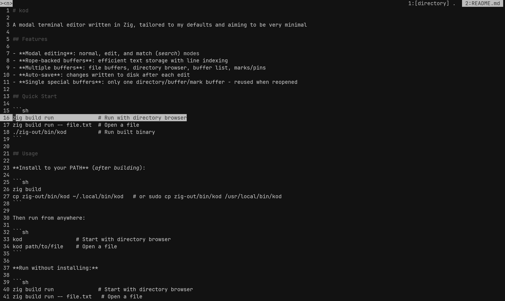

# kod

A modal terminal editor written in Zig, tailored to my defaults and aiming to be very minimal

<center>
    
</center>

## Features

- **Modal editing**: normal, edit, and match (search) modes
- **Rope-backed buffers**: efficient text storage with line indexing
- **Multiple buffers**: file buffers, directory browser, buffer list, marks/pins
- **Auto-save**: changes written to disk after each edit
- **Single special buffers**: only one directory/buffer/mark buffer - reused when reopened
- **Visible EOF marker**: every buffer renders an explicit `EOF` line after the final content line
- **HAST-style syntax classes**: grayscale highlighting grouped by structural token classes with font-weight contrast

## Syntax Highlighting

`kod` uses lightweight, HAST-inspired token classes instead of per-language color themes. Classes include comments, control/storage/modifier keywords, types, functions, literals, strings, numbers, punctuation, and operators.

The theme is intentionally grayscale. Contrast comes mostly from font weight (`bold`/`dim`) and brightness steps, which keeps visual noise low while still preserving code structure.

Implementation lives in `src/editor/syntax.zig` and is currently heuristic-based (not tree-sitter/LSP).

### Syntax Classes

`kod` classifies tokens into structural groups and maps them to grayscale ANSI attributes:

| Class | Typical tokens |
|-------|----------------|
| `comment` | `# ...`, `// ...` |
| `keyword_control` | `if`, `else`, `for`, `while`, `switch`, `return`, `try`, `catch` |
| `keyword_storage` | `const`, `var`, `fn`, `pub`, `struct`, `enum`, `union` |
| `keyword_modifier` | `inline`, `comptime`, `async`, `await`, `anytype`, `void` |
| `type` | identifiers starting with uppercase (`Foo`, `Result`) |
| `function` | identifier followed by `(` (excluding method-style `obj.fn`) |
| `literal` | `true`, `false`, `null`, `undefined` |
| `string` | quoted `'...'` and `"..."` values |
| `number` | numeric literals including `_` and decimal points |
| `punctuation` | brackets, commas, semicolons, colons, dots |
| `operator` | arithmetic, comparison, bitwise, and logical operator runs |

The highlighter is heuristic and line-based, so results are intentionally lightweight and fast rather than fully language-accurate.

## Quick Start

```sh
zig build run              # Run with directory browser
zig build run -- file.txt  # Open a file
zig build run -- src       # Open directory browser at ./src
./zig-out/bin/kod          # Run built binary
```

## Usage

**Install to your PATH** (after building):

```sh
zig build
cp zig-out/bin/kod ~/.local/bin/kod   # or sudo cp zig-out/bin/kod /usr/local/bin/kod
```

Then run from anywhere:

```sh
kod                 # Start with directory browser
kod path/to/file    # Open a file
kod path/to/dir     # Open directory browser at that path
kod .               # Open directory browser at current directory
```

**Run without installing:**

```sh
zig build run              # Start with directory browser
zig build run -- file.txt   # Open a file
zig build run -- src        # Open directory browser at ./src
./zig-out/bin/kod          # Run the built binary
```


## Status Bar

```
>< mode >            Centered input          Buffers...
```

- **Left**: Editor name and current mode
- **Center**: Typed command or search pattern  
- **Right**: Buffer tabs in MRU order

## Modes

### Normal Mode

Default mode for navigation and commands.

| Key | Action |
|-----|--------|
| `h` | Cursor left |
| `j` | Cursor down |
| `k` | Cursor up |
| `l` | Cursor right |
| `i` | Enter edit mode (insert before cursor) |
| `a` | Open line below (new line + edit mode) |
| `o` | Open line above (new line + edit mode) |
| `S` | Go to start of file |
| `E` | Go to end of file |
| `f` | Open directory browser |
| `b` | Open buffer list |
| `m` | Open marks/pins |
| `v` | Add a vertical split (up to terminal width limit) |
| `Tab` | Focus next split |
| `]` | Next buffer |
| `[` | Previous buffer |
| `?` | Open help buffer |
| `w` | Close current buffer |
| `q` | Close current buffer (legacy) |
| `x` | Delete char under cursor |
| `dd` | Delete current line |
| `de` | Delete until end of line |
| `r<c>` | Replace char under cursor with `<c>` |
| `p` | Paste below cursor |
| `P` | Paste above cursor |
| `/` | Enter match/search mode (search only) |
| `}` | Next search match |
| `{` | Previous search match |
| `>` | Indent line |
| `<` | Unindent line |
| `u` | Undo (placeholder) |
| `.` | Repeat last command (placeholder) |
| `Esc` | Return to normal mode |

### Edit Mode

Insert and edit text.

| Key | Action |
|-----|--------|
| Printable chars | Insert at cursor |
| `Backspace` | Delete char before cursor |
| `Enter` | Insert newline |
| `Esc` | Return to normal mode |

### Match Mode

Search through the buffer.

| Key | Action |
|-----|--------|
| `/pattern` | Search for pattern |
| `}` | Next match |
| `{` | Previous match |
| `Enter` | Jump to match line |
| `Esc` | Exit match mode |

## Commands

Commands use number syntax with `:`, `-`, or standalone numbers:

| Command | Action |
|---------|--------|
| `5` | Go to line 5 |
| `+3` | Scroll up 3 lines |
| `-2` | Scroll down 2 lines |
| `s5` | Select line 5 |
| `s3:5` | Select lines 3-5 |
| `y5` | Yank/copy line 5 |
| `y3:5` | Yank/copy lines 3-5 |
| `d5` | Delete line 5 |
| `d3:5` | Delete lines 3-5 |
| `dd` | Delete current line |
| `m1`-`m9` | Pin buffer to slot 1-9 |
| `m0` | Unpin from slot 0 |
| `0`-`9` | Jump to buffer by index (zero-based) |

## Keys Summary

```
Movement:   h j k l   S start, E end
Enter:     i a o     (insert, append, open above)
File:      f b m v tab ] [ w
Search:    / { }
Edit:      x delete, dd line, r replace, > < indent
           p paste below, P paste above
Commands:  +/- scroll, number goto
           s select, y yank, d delete
           m mark (pin), u undo, . repeat
Buffers:   0-9 direct jump (zero-based)
```

## Building

```sh
zig build         # Build
zig build test    # Run tests
zig build run     # Run editor
zig build bench   # Run microbenchmarks (rope + buffer workloads)
```

## Benchmarking And Instrumentation

```sh
zig build bench
zig build -Denable-instrumentation=true
zig build run -Denable-instrumentation=true
```

- `zig build bench` builds and runs a dedicated benchmark executable (`kod-bench`).
- Instrumentation is compile-time gated and off by default for normal deliverable builds.
- With instrumentation enabled, runtime timing and event counters are printed on shutdown.

## Requirements

- Zig 0.15+
- POSIX-compatible system (Linux, macOS)
